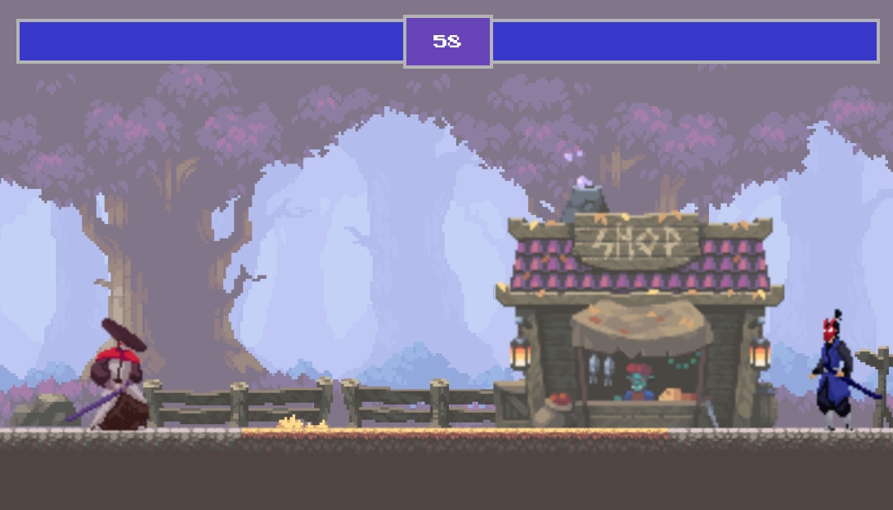

#  Fighter's Attack

  

  

##  Description

  

Fighter's Attack is two player fighting game for PC only.

Both plays will fight have 60 second to defeat one another. Upon 60 seconds, the player with the lower life bar will lose.

  
  

##  Play the Game

  

To start the game, press any key.

  

Move toward your enemy to strike them. If your player is within striking range of your attack, your enemy will lose health (this will be noticed as either health bar will decrease).

  

###  Controls

**Player Controls**
  
*Player 1*

 - (a) - Move player to the left
   
 -  (d) - Move player to the right
   
 - (w) - Make player jump up
   
 - (s) - Make player jump down
   
 - (SPACEBAR) - Attack to the right

  
*Player 2*

 - (RightArrow) - Move player to the left

 - (LefttArrow) - Move player to the right

 - (UpArrow) - Make player jump up

 - (DownArrow) - Make player jump down

 - (/) - Attack to the right

*Restart*

 - (Restart) - Click on to the restart button to reset the game to 60
   seconds.

  
  
  

##  Features

List the key features of your game, such as:

- Feature 1: This game allows players to move in all 4 directions with effects of gravity and plane that acts as the ground.
- Feature 2: Characters are able to strike each other and have a direct effect on their health bar. 
- Restart feature launches after a time limited has been set. 
- All characters have been sized to match the background canvas.
- Animations have been create for the following characters: background house, Player 1, and Player 2. 

  

##  Technologies Used

*JavaScript*
- For the players and images, class have been a great told to stream line coding and objects.
- draw(), update(), and animateFrames() are key functions that act as key animation features. Animations would not work without these functions. 
- AttackBox() function, combatZone() function and their related parameters are key in creating the UI that allows one player 1 to effect another player. 
- timerID and timeJS are key variables in all the determineWinner() to has a time dependency. These variables are also key in creating the time environment.  
- The images are stocked on-top of each other using JavaScript. Thus the others in which their are animated play a key role in the display of the game. 

*HTML*
- Health bars and timer are all on the same DIV. Allowing them to act well together.
- The winner messages use the flex property and are set to none until a the determineWinner() function executes.
- The restartButtom function is coded directly into the HTML file to limit any errors that may be created if it was coded in the index.js file.

*CSS*

 - For this program, the CSS is coded directly into the index.HTML file. This helps to limit the file structure, as the HTML code is small at this point in the projects development. 
 - The position property is utilized as a key tool to allow for a proper layout of all of the HTML elements. 
 - The display : flex style property is tied in with the JavaScript code. Based on what happens in the game, the display property will either be set to none or flex. 

  

##  Roadmap

 - A separate file for the CSS code would be needed for any additional styling.
 - A startup bag will be an additional page to add. Extending the HTML code but utilizing functions/tools already used in the JavaScript code. 
 - Music that is played based one the timing of the same and the player actions will come next.
 - For players, creating additional player moves and attacks will come next. 
 - Adding Ai to the JavaScript will allow the game to evolve into Player vs. Computer settings.  

  

##  Contributing

Thanks to the following contributors for coding help and image design:

Creator Account: Chris Courses
Contribution: Coding and Design
Platform: Youtube
Webpage: https://www.youtube.com/@ChrisCourses

Creator Account: LuizMelo
Contribution: Image Design
Platform: Webpage
Webpage: https://luizmelo.itch.io/

Creator Account: Megha Zavar
Contribution: Code Development/Troubleshooting
Platform: University of Chicago - Software Engineering Bootcamp
Webpage: https://www.linkedin.com/in/megha-zavar/

Creator Account: John Margotti
Contribution: Code Development/Troubleshooting
Platform: University of Chicago - Software Engineering Bootcamp
Webpage: https://www.linkedin.com/in/john-margotti/

##  Acknowledgments

Creator Account: LuizMelo
Contribution: Image Library
Platform: Webpage
Webpage: https://luizmelo.itch.io/.

  

##  Contact

Please feel free to contact Justin at justin.bucsa@gmail.com or via LinkedIn at https://www.linkedin.com/in/justin-bucsa/
  

##  Author

Justin Bucsa
	- Justin is a professional engineer. This is for attempt into game design. Please enjoy. 

 
Enjoy playing the game!
